# PT. BATUKARANG KENAN ABADI

[www.bkka.site]()

---

## Introduction

Hi ! Welcome to my **Assignment 2** in RevoU Class. The purpose of this documentation is to provide me or others with information about the learning curve that i received in RevoU Class. I find this assignment to be very helpful for me and maybe others who has the same difficulty and goals like me.

This file will be updated overtime to reflect what I have learned through out my studies in RevoU Class, as well as a type of of self training to get me used for documenting my progress. In this case, my website [www.bkka.site]().

I hope that this **information** may be useful to help us **connect** together, and may help us to finish future projects together as well as creating a great **supporting community** for better **learning environment**.

> ✨ Things are never quite as scary when you've got a best friends

This is a brief overview of my data, I hope this will help you to understand me a little bit more.

|   Data    |       Description        |
| :-------: | :----------------------: |
| Full Name |      Clement Hansel      |
|    Sex    |           Male           |
|    Age    |            33            |
|  Status   |          Single          |
|   Hobby   | Swimming and Adventuring |
|  E-mail   |  [greedybugz@gmail.com]  |
|   Phone   |      +628111546034       |

For those who are still afraid about things that you dont understand, please know, that I am also in that particular environment now. But lets be brave and walk it through step by steps and keep visioning our goals.

---

## Website - [www.bkka.site]()

Welcome to my company website ! In this website you will find all the information about PT. BATUKARANG KENAN ABADI. There are a few pages that you may browse through in the site. There are :

1. Home Page
2. Products Page
3. Solution Page
4. Markets Page
5. Partners Page
6. About Page
7. Contact Page
8. Login Page

The purpose of this website is to show case the company, its products and services as well as a landing page for other purpose such as intranet. This website is also responsive and have the day and night feature with local storage setting. so it will not change when navigating the site

### Home Page

This page is the main page of the website. it consist of :

1. Navbar Section
   This section is for all the navigation of the web. it is responsive with the tablet and small screen in one design and the large screen with some design alteration. the mobile is using the animated hamburger button, with submenu.
2. Hero Section
   This section is used for some tagline and show what the company does and offer. It consist of an image with some absolute position of some text. A button that link to contact us
3. Solution Section
   This section is used to show case the solution provided by the company.
4. Products Section
   This section is used to show case the Products offered by the company.
5. Market Section
   This section is a carousel with CSS setting and no java screen. The image is in autoplay and can be directed with arrow.
6. Encouragement Section
   This section consists of an image only
7. Subscribe Section
   This section consists of an image with an email input and an action button.
8. Footer
   This section consists of two parts. The first part is for the company logo, Social Media icons, copyright and privacy policy link. The last part is for all the navigations.

### Products Section

This Section is used to showcase the products offered by the company. It consist of :

1. Monitoring Page
2. Sensors Page
3. Access Management Page
4. Parking System Page

#### Monitoring Page

This page consists of the monitoring products provided by the company.
This page have 5 sections, in which the main section contain images and description of the monitoring related products that the company provide.

1. Navbar Section
2. Hero Section
3. Main Section
4. Subscribe Section
5. Footer Section

#### Sensors Page

This page have information on the Sensors related products sold by the company.
This page have 5 sections, in which the main section contain images and description of the sensors related products that the company provide.

1. Navbar Section
2. Hero Section
3. Main Section
4. Subscribe Section
5. Footer Section

#### Access Management Page

This page consists of the Access Management products provided by the company.
This page have 5 sections, in which the main section contain images and description of the Access Management related products that the company provide.

1. Navbar Section
2. Hero Section
3. Main Section
4. Subscribe Section
5. Footer Section

#### Parking System Page

This page consists of the Parking System products provided by the company.
This page have 5 sections, in which the main section contain images and description of the Parking System related products that the company provide.

1. Navbar Section
2. Hero Section
3. Main Section
4. Subscribe Section
5. Footer Section

### Solutions Section

This Section is used to showcase the Solutions offered by the company. It consist of :

1. ISMS Page
2. WIM Page
3. ISHMS Page
4. VPMS Page

#### ISMS Page

This page have the information of the Integrated Security Management System Solution provided by the company.
This page have 5 sections, in which the main section contain images and description of the ISMS related Solutions that the company provide.

1. Navbar Section
2. Hero Section
3. Main Section
4. Subscribe Section
5. Footer Section

#### WIM Page

This page have the information of the Weigh in Motion System Solution provided by the company.
This page have 5 sections, in which the main section contain images and description of the WIM related Solutions that the company provide.

1. Navbar Section
2. Hero Section
3. Main Section
4. Subscribe Section
5. Footer Section

#### ISHMS Page

This page have the information of the Intelligent Structure Health Monitoring System Solution provided by the company.
This page have 5 sections, in which the main section contain images and description of the ISHMS related Solutions that the company provide.

1. Navbar Section
2. Hero Section
3. Main Section
4. Subscribe Section
5. Footer Section

#### VPMS Page

This page have the information of the Vehicle Parking Management System Solution provided by the company.
This page have 5 sections, in which the main section contain images and description of the VPMS related Solutions that the company provide.

1. Navbar Section
2. Hero Section
3. Main Section
4. Subscribe Section
5. Footer Section

### Markets Section

This Section is used to showcase the Markets aimed by the company. It consist of :

1. Telecom Page
2. Goverment Page
3. Infrastructure Page
4. Industrial Area Page
5. Commercial Buildings Page
6. Residential Area Page
7. Parking Area Page

#### Telecom Page

This page have the information of the Telecom Market aimed by the company.
This page have 5 sections, in which the main section contain images and description of the Telecom related Market and solutions that the company provide.

1. Navbar Section
2. Hero Section
3. Main Section
4. Subscribe Section
5. Footer Section

#### Goverment Page

This page have the information of the Goverment aimed by the company.
This page have 5 sections, in which the main section contain images and description of the Goverment related Market and solutions that the company provide.

1. Navbar Section
2. Hero Section
3. Main Section
4. Subscribe Section
5. Footer Section

#### Infrastructure Page

This page have the information of the Infrastructure Market aimed by the company.
This page have 5 sections, in which the main section contain images and description of the Infrastructure related Markets and solutions that the company provide.

1. Navbar Section
2. Hero Section
3. Main Section
4. Subscribe Section
5. Footer Section

#### Industrial Area Page

This page have the information of the Industrial Area Market aimed by the company.
This page have 5 sections, in which the main section contain images and description of the Industrial Area and solutions related Markets that the company provide.

1. Navbar Section
2. Hero Section
3. Main Section
4. Subscribe Section
5. Footer Section

#### Commercial Buildings Page

This page have the information of the Commercial Buildings Market aimed by the company.
This page have 5 sections, in which the main section contain images and description of the Commercial Buildings related Markets and solutions that the company provide.

1. Navbar Section
2. Hero Section
3. Main Section
4. Subscribe Section
5. Footer Section

#### Residential Area Page

This page have the information of the Residential Area Market aimed by the company.
This page have 5 sections, in which the main section contain images and description of the Residential Area related Markets and solutions that the company provide.

1. Navbar Section
2. Hero Section
3. Main Section
4. Subscribe Section
5. Footer Section

#### Parking Area Page

This page have the information of the Parking Area Market aimed by the company.
This page have 5 sections, in which the main section contain images and description of the Parking Area related Markets and solutions that the company provide.

1. Navbar Section
2. Hero Section
3. Main Section
4. Subscribe Section
5. Footer Section

### Partners Section

This page have the information on how to become a partner with the company. It also have the input forms for the user to fill in.
This page have 5 sections, in which the main section contain description and forms.

1. Navbar Section
2. Hero Section
3. Main Section
4. Subscribe Section
5. Footer Section

### About Section

This page have information about the company. This section have 2 pages:

1. Company Profile Page
2. Join Us Page

#### Company Profile Page

This page have information about the company. It also have the input forms for the user to fill in.
This page have 5 sections, in which the main section contain The Company Profile Images.

1. Navbar Section
2. Hero Section
3. Main Section
4. Subscribe Section

#### Join Us Page

This page have information about career opportunity in the company. It also have the input forms for the user to fill in.
This page have 5 sections, in which the main section contain The forms that the user can fill.

1. Navbar Section
2. Hero Section
3. Main Section
4. Subscribe Section

### Contact Section

This page have the information on how to Contact the company. It also have the input forms for the user to fill in.
This page have 5 sections, in which the main section contain description and forms.

1. Navbar Section
2. Hero Section
3. Main Section
4. Subscribe Section
5. Footer Section

### Login Section

This page used to log in the company Intranet. This login page will be the gateway to a personalized dashboard that will be implemented later.
This page have 5 sections, in which the main section contain the signin and signup forms.

1. Navbar Section
2. Hero Section
3. Main Section
4. Subscribe Section
5. Footer Section

## Deployment

This is some documentation for the deployment of my website.

1. Make a project repository in Github.
   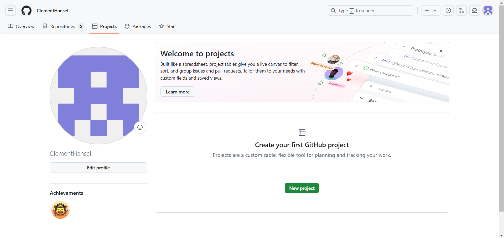
2. Add, Push and Commit the Websites files to Github project repository that I have made.
3. Open Netlify account.
   
4. Click "Add New Site" and "import an existing project" option.
5. 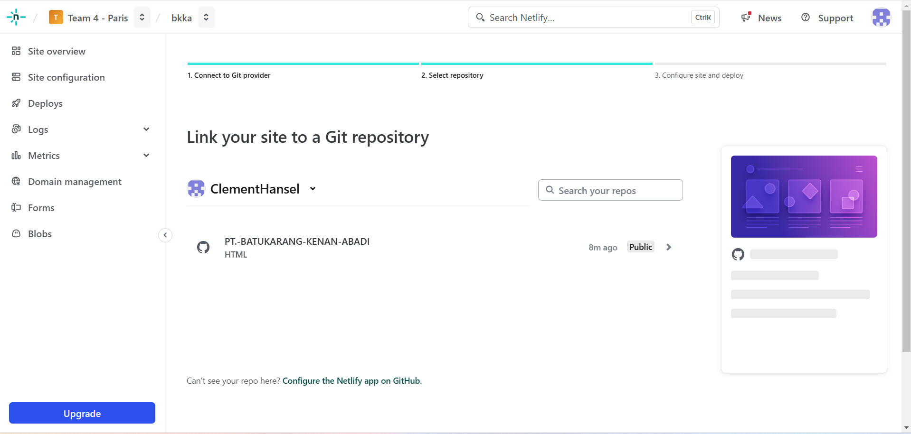
6. Click "Github" button.
   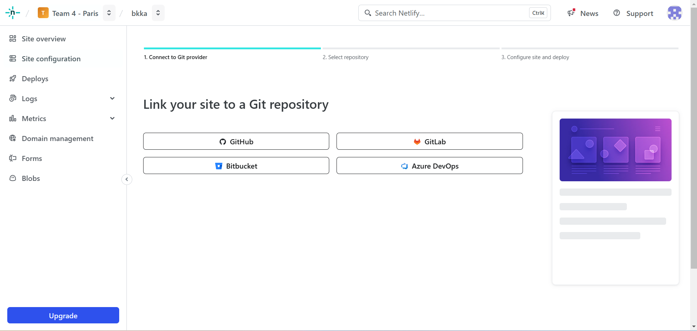
7. Click "configure Netlify on github" Button.
   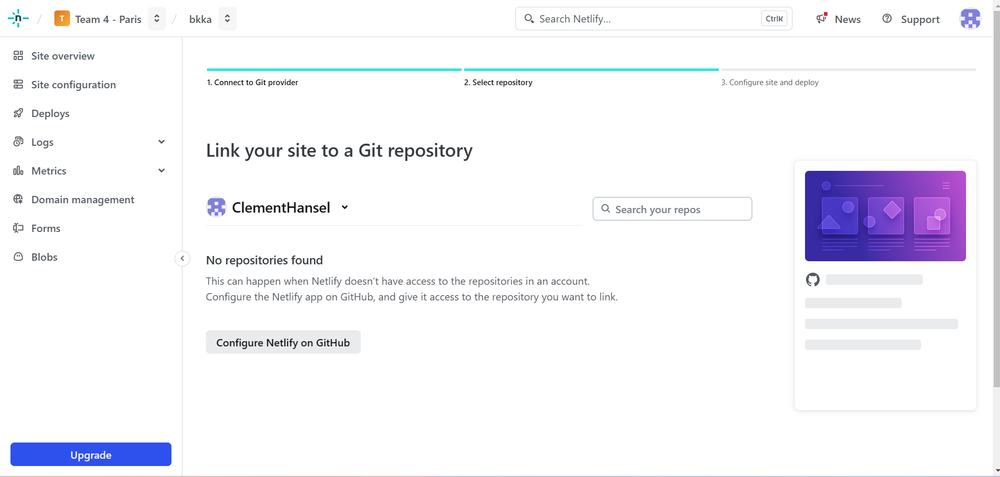
8. Choose your Github repository.
   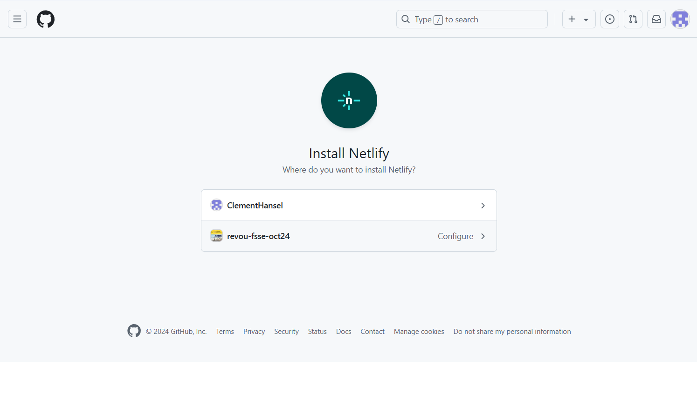
9. Choose "Only Select Repository" option. And your github repository, and click "Install"
   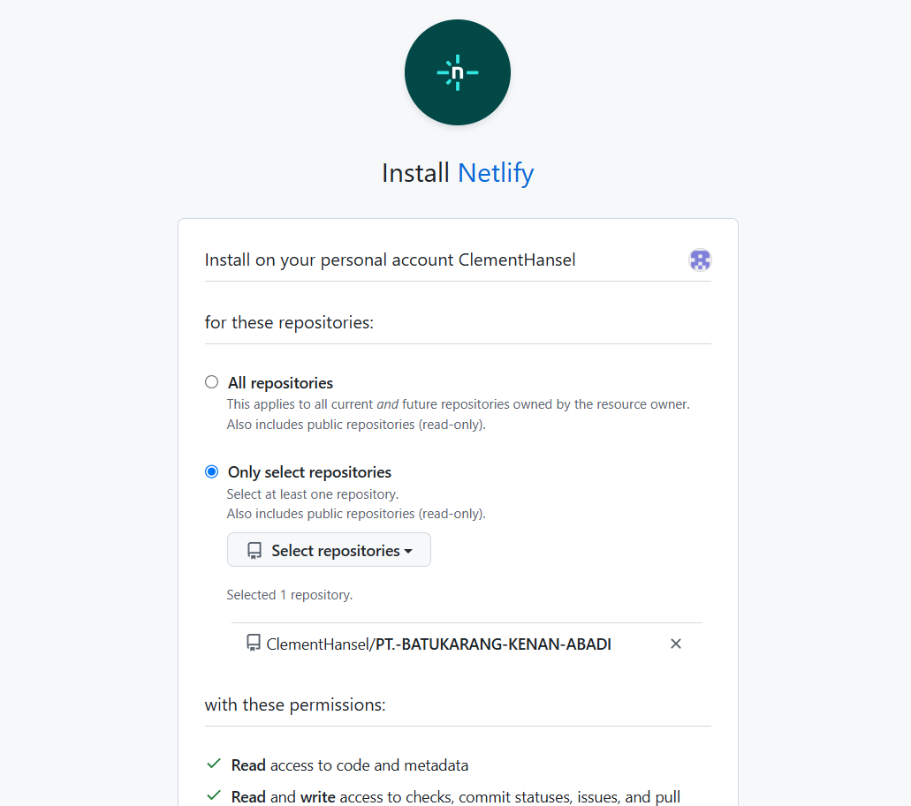
   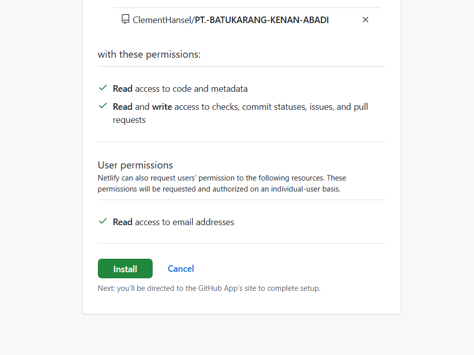
10. Back to your Netlify dashboard, Click "Deploy" button.
    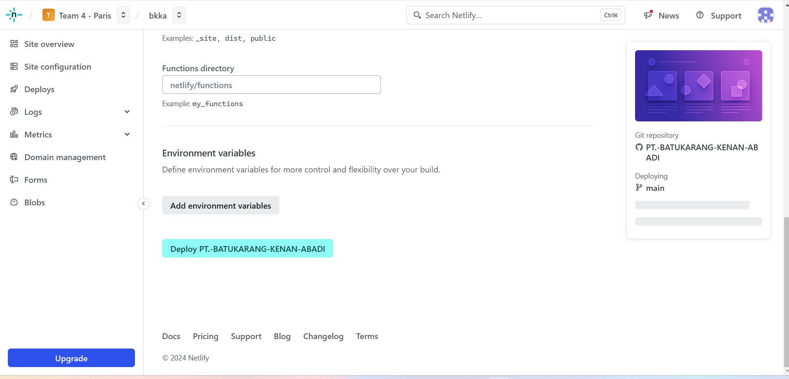
11. On the left side of the dashboard, you will see the "Domain Management", click it.
    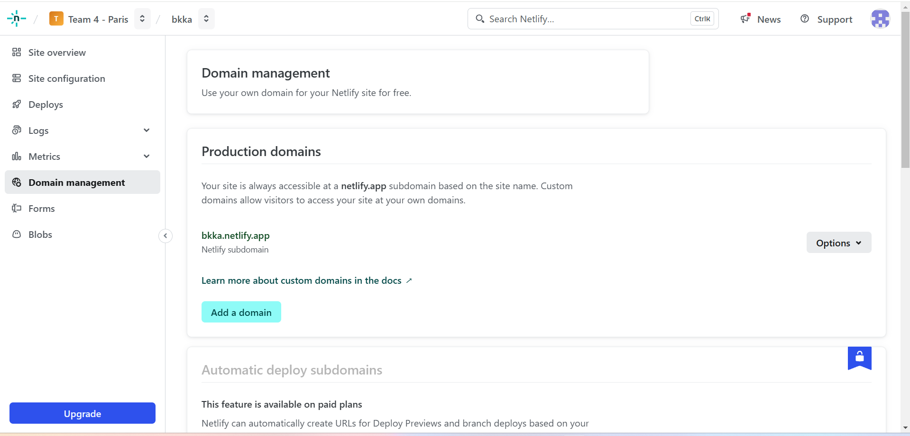
12. Click "Add Domain" button.
13. Fill your domain name, and click "verify" button.
    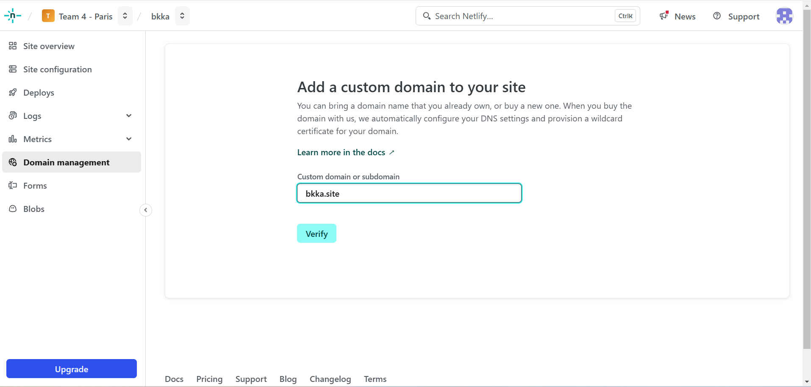
14. In the left Netlify dashboard, click "Domain" tab.
15. In the "Name Server" Tab copy the Netlify DNS.
    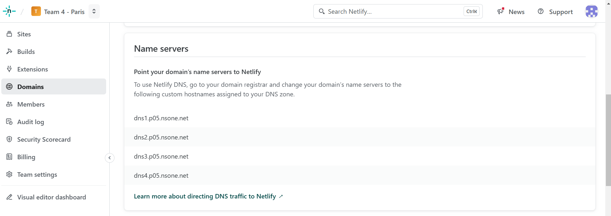
16. Go to the domain dashboard. click "DNS/Name Server" Tab
17. in the DNS Record tab, paste the copied Netlify DNS. and click "Ganti Server" button.
    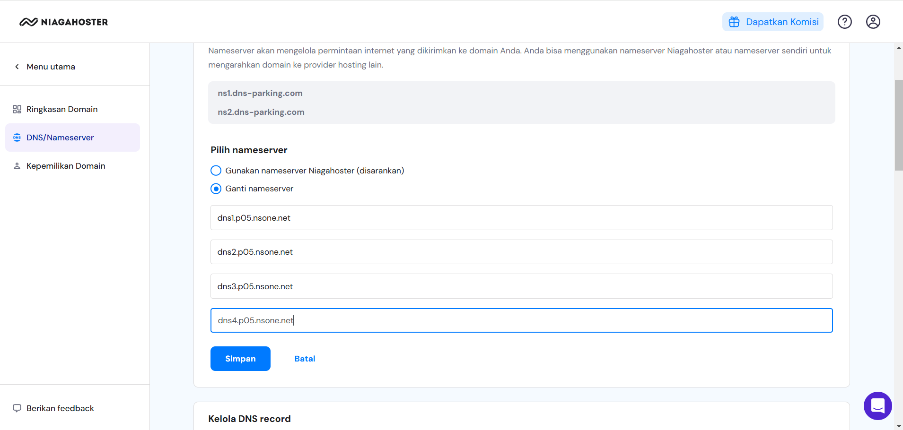
18. Wait for 24 Hours and your site will be live with the new domain.

This is going to be used as a web hosting platform. It is free and allows you to deploy your website in minutes.

## Epilogue

With this document, I have written a 1 month long journey at RevoU to study many aspects of Software Development, mainly to become a Fullstack Developer. My journey here is not done yet, in fact, it open a broader and wider oppurtunity to explore. The things that inspire me is to create an automated systems that integrated technology, AI, and Human touch to enhance human being both as a unique individual, but as a community as a whole. The purpose of this system later on is to give Human much opportunity to enjoy life with maximum satisfaction possible. The goal is achieved when we as a human, no longer needs to sacrifice so much of our time to do repetitive and menial tasks, as well as dangerous and risky tasks just in order to survive dailly needs. With this clear goal in mind, there will be long tough road ahead of me. Alas, by completeion of this documentation, I can proudly said that the first step has been completed successfully. And I hope my future projects will find you well, and be able to contribute much to you and the community. - [FIN] -
